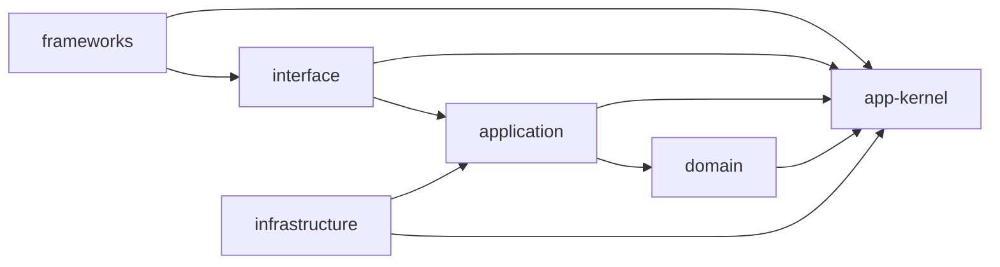

# Design guidelines

Satisfy the dependency rule of [The Clean Architecture](https://blog.cleancoder.com/uncle-bob/2012/08/13/the-clean-architecture.html) as a requirement. Splitting adapters into driving and driven follows [Ports and Adapters](https://alistair.cockburn.us/hexagonal-architecture/); the `<bounded_context>` axis and the constraint on vocabulary follow [DDD](https://www.domainlanguage.com/ddd/reference/).

What follows is a synthesis of those, not a copy of the CA diagram. Output ports are not used.

## Placement

```
src/app-kernel/<name>.ts
src/<layer>/<kind>/<bounded_context>/<name>.<kind>.ts
src/application/ports/<kind>/<bounded_context>/<name>.<kind>.ts
src/frameworks/<framework>/…
```

The layers are fixed at six: `app-kernel` `domain` `application` `interface` `infrastructure` `frameworks`. `<kind>` is not fixed — hold the kinds that layer needs (`entities`, `value-objects`, `services`, `errors`, `use-cases`, `controllers`, `presenters`, `repositories`, `integrations`, and so on).

- A file's suffix is the singular of its `<kind>` (`value-objects/` → `.value-object.ts`).
- What `application` needs from outside is declared under `ports/`. The implementation lives in `infrastructure`.
- Bounded contexts are declared in one place. Every directory named for a context, in every layer, belongs to that set.
- Inside `frameworks/<framework>/`, follow that framework's own conventions.

## Dependencies



- `interface` does not see `domain`.
- `frameworks` does not see `application`.
- `domain` does not import across bounded contexts. Coordinating across contexts is `application`'s work.
- `app-kernel` imports nothing else in `src/` (it is a leaf).
- `domain` and `application` import no external package other than `app-kernel`.
- Every layer declares the layers it may see in the build configuration. A violation is a **compile error**.

## Composition

- There is one composition root: `composition` directly under `src/`. **It is the only place that may import across layers**, and `frameworks` uses it.
- A directory may hold a `composition` that binds its own children. It binds only the children of its own level, and a layer's `composition` imports nothing outside its layer.
- Bind in dependency order — what is depended upon first.
- The list being bound is guarded by types. A missing registration fails at compile time, not at run time.
- **A container or resolver never crosses a boundary.** The inside receives its dependencies as arguments. Hand it a way to pull things out and the import graph stops telling the truth.
- Composition registers implementations of the ports declared on the inside.

## Words

- The inside is written in the language of the business. Technology and vendor names (GoogleDrive, WorkOS, Prisma, S3, HTTP) may appear only in `infrastructure` and `frameworks`.
- The constraint reaches identifiers, type names, filenames, comments, and error messages.
- A port names a capability in business terms (`storage.integration.ts`). An adapter prefixes the technology to the port's name (`google-drive-storage.integration.ts`), even when there is only one implementation.
- One adapter implements exactly one port.

## Failure

- Failure that belongs to the contract is returned as a `Result` value. `throw` is for bugs — broken invariants, unreachable states.
- Every layer has its own errors and rewraps them into the outer layer's at the boundary, keeping the chain in `cause`. An inner error never escapes outward as it is.

## Output

- A use-case returns a `Result`. A presenter is a pure function from output to display form. Branching on success and failure belongs to the controller.

## Tests

- `/test` sits beside `/src` and mirrors the layers completely, written as `*.spec.ts`.
- `/test/<layer>/` may import only `src/<layer>` and `app-kernel`.
- Tests tied to no layer (`/test/e2e`, `/test/browsers`) sit outside the mirror, directly under `/test`.
- The dependency rule applies only under `/src`.
